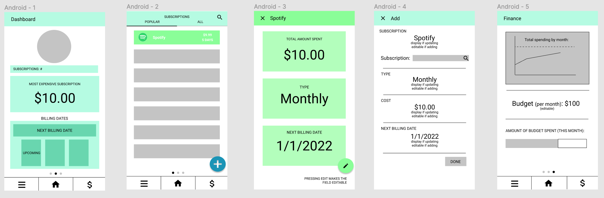

# *Subbed*

**Subbed** is a subscription tracking app that helps manage what services one is subbed to along with related finances.

**Group name:** Subber

## 1. User Stories (Required and Optional)

**Required Must-have Stories**

  - [ ] Users can: 
      - [ ] View and interact with a dashboard (displaying various statistics about the user's subscriptions).
      - [ ] Add a subscription.
      - [ ] View a list of subscriptions.
      - [ ] View details of each subscription.
      - [ ] Update a subscription.
      - [ ] Delete a subscription.
      - [ ] View the next billing date (on the dashboard), along with amount and associated subscription.

**Optional Nice-to-have Stories**

  - [ ] Users can: 
      - [ ] View overall financial information of their subscriptions.
      - [ ] Set a budget.
      - [ ] View total spending (by month, by year).
      - [ ] Select subscription to add from list of available subscriptions.
      - [ ] Switch from light mode to dark mode.
      - [ ] Select different filters on the subscription screen.
  - [ ] Each subscription listing’s style will match the theme of the subscription service. 
  - [ ] Dots towards the bottom of the screen indicate which screen the user is on.

## 2. Screen Archetypes

* Main Screen (Dashboard)
   * Users can view and interact with a dashboard (displaying various statistics about the user's subscriptions).
   * Users can view the next billing date (on the dashboard), along with amount and associated subscription.
 * Subscription Screen
   * Users can add a subscription.
   * Users can view a list of subscriptions.
   * Users can update a subscription.
   * Users can delete a subscription.
 * Finance Screen
   * Users can view overall financial information of their subscriptions.
 * Details Screen
   * Users can view details of each subscription.

## 3. Navigation

**Tab Navigation** (Tab to Screen)

 * Tab to Main Screen
 * Tab to Subscription Screen
 * Tab to Finance Screen

**Flow Navigation (swipe)** (Screen to Screen)

 * Main Screen
   * User swipes right: navigate to Subscription Screen
   * User swipes left: navigate to Finance Screen.

**Flow Navigation (widget)** (Screen to Screen)

 * Subscription Screen
   * User presses on related widgets on dashboard to navigate to Subscription Screen
      * Can navigate by tabs or swiping once there
 * Finance Screen
   * User presses on related widgets to naviagte to Finance Screen
      * Can navigate by tabs or swiping once there

## 4.Wireframe
**Link to our Figma design:** https://www.figma.com/file/keeGWENYi6FWzI1sRuFCbC/Subbed?node-id=0%3A1

<br>

## Schema 
### Models
#### Subscription

   | Property      | Type     | Description |
   | ------------- | -------- | ------------|
   | objectId      | String   | unique id for the subscription (default field) |
   | subscriptionName   | String | subscription name |
   | color         | String     | color of the subscription |
   | price       | Number   | price of the subscription |
   | type   | String   | monthly / yearly |
   | startDate    | DateTime   | date when subscription is created |
   
### Networking
#### List of network requests by screen
   - Home Feed Screen
      - (Read/GET) Query all subscriptions
         ```swift
        ParseQuery<Sub> query = ParseQuery.getQuery(Sub.class);      
        query.findInBackground(new FindCallback<Sub>() {
            @Override
            public void done(List<Sub> subs, ParseException e) {
                if (e != null) {
                    Log.e(TAG, "Issue with getting subscriptions", e);
                    return;
                }
                for (Sub sub : subs) {
                    Log.i(TAG, "Sub: " + sub.getName() + ");
                }
                allSubs.addAll(subs);
                adapter.notifyDataSetChanged();
            }
        });
         ```
      - (Create/POST) Create a new subscription
      - (Delete) Delete an existing subscription
      - (PUT) Update the subscription
