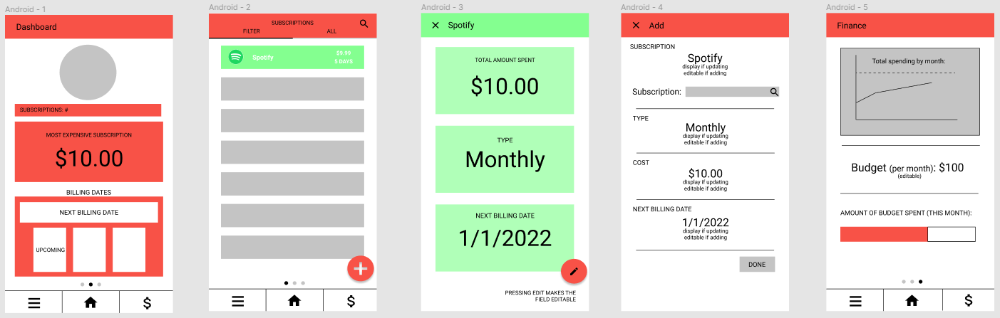
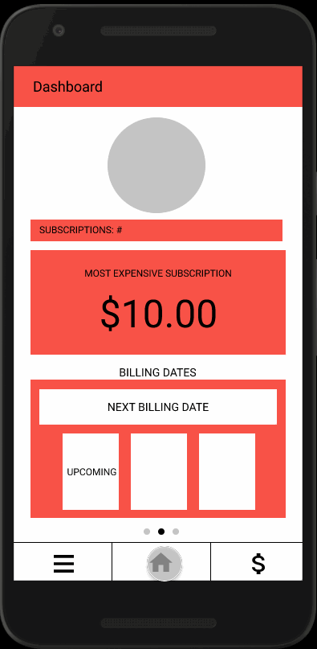
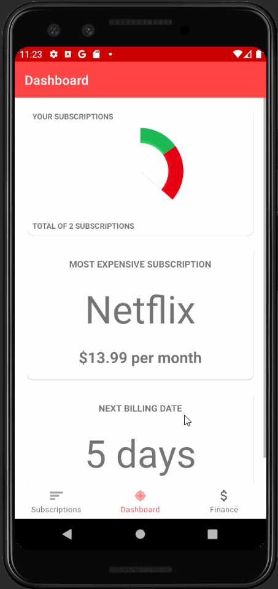

# *Subbed*
**Group name:** Subbers

## Table of Contents
1. [Overview](#Overview)
1. [Product Spec](#Product-Spec)
1. [Wireframes](#Wireframes)
1. [Schema](#Schema)

## Overview
### Description
**Subbed** is a subscription tracking app that helps manage what services one is subbed to along with related finances.

### App Evaluation
- **Category:** Financial Management
- **Mobile:** This product will be primarily geared towards mobile users, but can also be effectively transferred to a web application (which would require implementing user login functionality). Useful as a mobile app because phones have become peoples' main and easiest-to-access tool, including a tool for managing finances.
- **Story:** Tracks what subscription services a user is subbed to and helps manage related finances by displaying billing dates/information and also allowing the user to set a budget. 
- **Market:** For any individual who wishes to organize and manage their subscription finances (realistically people 18 years or older who can purchase their own subscriptions).  - **Habit:** This app could become part of routine financial management. App usage would broadly coincide with billing cycles.
- **Scope:** No limit to the app's scope. Additional features may be later implemented to improve the user experience and make managing subscriptions even easier (e.g. allow users to subscribe, cancel, and manage subscription settings via the app).

## Product Spec
### 1. User Stories (Required and Optional)

**Required Must-have Stories**

  - [ ] Users can: 
      - [ ] View and interact with a dashboard (displaying various statistics about the user's subscriptions).
      - [x] Add a subscription.
      - [x] View a list of subscriptions.
      - [ ] View details of each subscription.
      - [ ] Update a subscription.
      - [ ] Delete a subscription.
      - [ ] View the next billing date (on the dashboard), along with amount and associated subscription.

**Optional Nice-to-have Stories**

  - [ ] Users can: 
      - [ ] View overall financial information of their subscriptions.
      - [ ] Set a budget.
      - [ ] View total spending (by month, by year).
      - [ ] Select subscription to add from list of available subscriptions.
      - [ ] Switch from light mode to dark mode.
      - [ ] Select different filters on the subscription screen.
      - [ ] Apply filters to the Subscription Screen
  - [ ] Each subscription listing’s style will match the theme of the subscription service. 
  - [ ] Dots towards the bottom of the screen indicate which screen the user is on.

### 2. Screen Archetypes

* Main Screen (Dashboard)
   * Users can view and interact with a dashboard (displaying various statistics about the user's subscriptions).
   * Users can view the next billing date (on the dashboard), along with amount and associated subscription.
 * Subscription Screen
   * Users can add a subscription.
   * Users can view a list of subscriptions.
   * Users can update a subscription.
   * Users can delete a subscription.
 * Finance Screen
   * Users can view overall financial information of their subscriptions.
 * Details Screen
   * Users can view details of each subscription.

## 3. Navigation

**Tab Navigation** (Tab to Screen)

 * Main Screen (Dashboard)
 * Subscription Screen
 * Finance Screen

**Flow Navigation (swipe)** (Screen to Screen)

 * User can swipe left and right to navigate between tabs

**Flow Navigation (widget)** (Screen to Screen)

 * Subscription Screen
   * User presses on related widgets on dashboard to navigate to Subscription Screen
      * Can navigate by tabs or swiping once there
 * Finance Screen
   * User presses on related widgets to naviagte to Finance Screen
      * Can navigate by tabs or swiping once there

## Wireframes
**Link to our Figma design:** https://www.figma.com/file/keeGWENYi6FWzI1sRuFCbC/Subbed?node-id=0%3A1

<br>

### [BONUS] Interactive Prototype


## Schema 
### Models
#### Subscription

   | Property           | Type     | Description |
   | ------------------ | -------- | ------------|
   | objectId           | String   | unique id for the subscription (default field) |
   | subscriptionName   | String   | subscription name |
   | theme              | String   | theme color for the subscription |
   | type               | String   | type of subscription (e.g. monthly / yearly) |
   | cost               | Number   | cost of the subscription |
   | startDate          | DateTime | date when subscription began |
   | createdAt          | DateTime | date when subscription is created (default field) |
   | updatedAt          | DateTime | date when subscription is last updated (default field) |
   
### Networking
#### List of network requests by screen
   - Main Screen (Dashboard)
      - (Read/GET) Query all subscriptions
          ```
         ParseQuery<Sub> query = ParseQuery.getQuery(Sub.class);      
         query.findInBackground((subs, e) -> {
                 if (e != null) {
                     Log.e(TAG, "Issue with getting subscriptions", e);
                     return;
                 }
                 for (Sub sub : subs) {
                     Log.i(TAG, sub.getName() + " subscription retrieved");
                 }
                 allSubs.addAll(subs);
                 adapter.notifyDataSetChanged();
         });
         ``` 
   - Subscription Screen
      - (Read/GET) Query all subscriptions
      - (Create/POST) Create a new subscription
      - (Delete) Delete an existing subscription
   - Finance Screen
      - (Read/GET) Query all subscriptions
   - Details Screen
      - (Update/PATCH) Update an existing subscription
      - (Delete) Delete an existing subscription

## Video Walkthrough

Here's a walkthrough of implemented user stories for sprint 1:




GIF created with [Kap](https://getkap.co/) and [LICEcap](https://www.cockos.com/licecap/).

---
Here's a walkthrough of implemented user stories for sprint 2:


GIF created with [Kap](https://getkap.co/) and [LICEcap](https://www.cockos.com/licecap/).
